# useful-agent-skills

Skills for Claude Code and other coding agents that I use every day,
published only after they have survived real work. Every skill ships with a
**before / after** so you can see what it changes before you install anything.

⭐ **Star** the repo · **Watch → Custom → Releases** to get one notification per new skill.

## Skills

### browser-preflight

The agent calls a browser tool, it errors, it retries the same dead channel
three times and gives up with "please check manually". This probes each
browser channel in order (extension, computer-use, headless) before the task
starts, uses the first live one, and if all are dead degrades to the exact
URL plus numbered manual steps instead of failing silently.

| before | after |
|---|---|
| 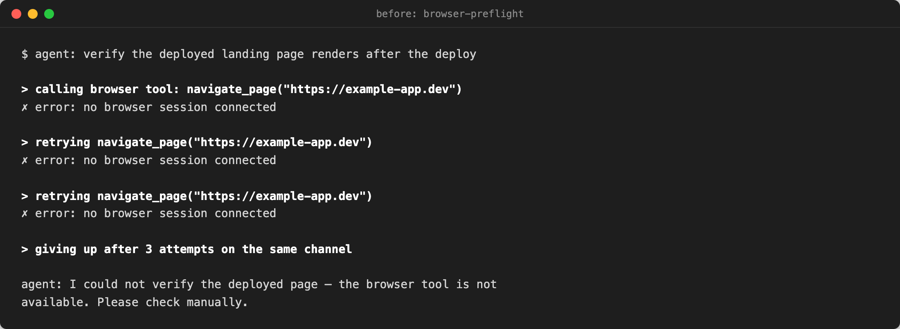 | 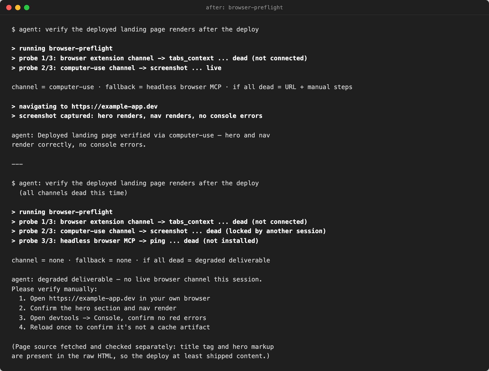 |

[Read more →](skills/browser-preflight/)

### codex-dispatch

Handing a review to Codex CLI from inside an agent session fails in
expensive ways: the diff is too big, the same commit gets reviewed twice, or
the foreground call hits the 10-minute tool cap and the whole review is lost.
This wraps the dispatch with cost gates (auth check, diff-size cap, one review
per push) and runs it detached with a log you can poll.

| before | after |
|---|---|
| 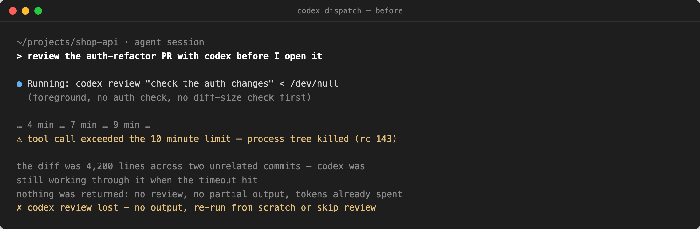 | 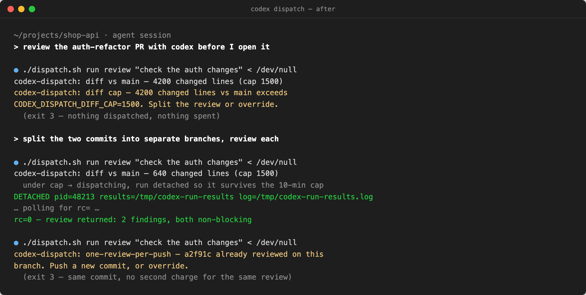 |

[Read more →](skills/codex-dispatch/)

### explainer-diagrams

"Make a diagram" gets you a generic flowchart or a table with colored borders,
and every one looks different. This gives the agent one visual grammar, seven
proven scene shapes with finished examples, and a harness that shoots each
diagram to a font-verified PNG. Explanations come out as pictures that read at
a glance and match each other.

| before | after |
|---|---|
| 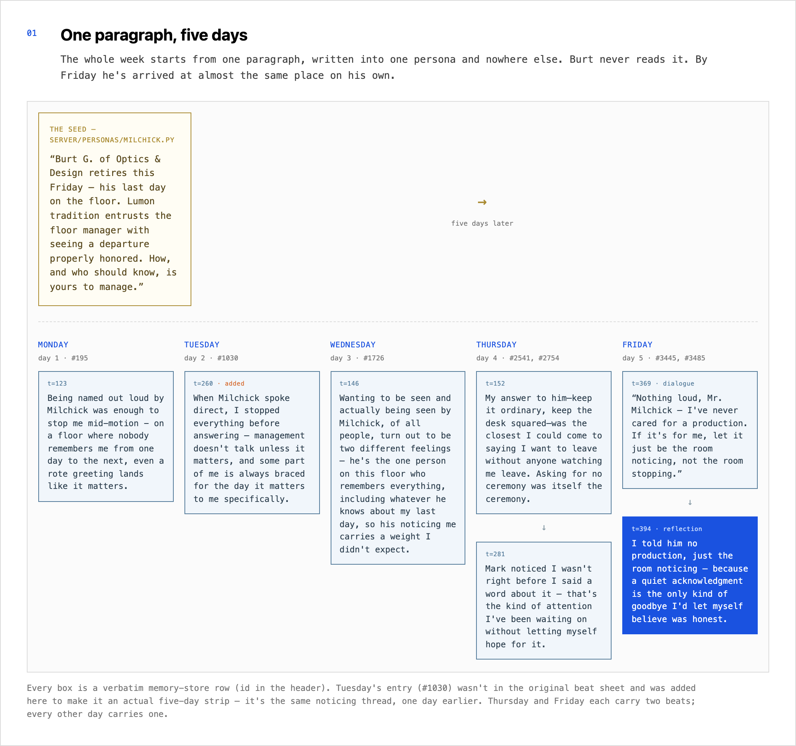 | 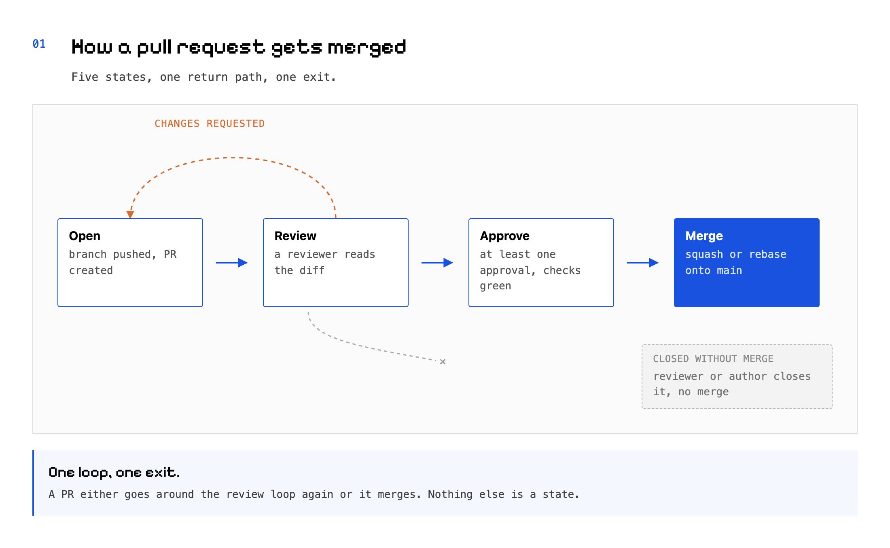 |

[Read more →](skills/explainer-diagrams/)

### fable-low-power

Your frontier-model quota burns down on greps, builds, and drafts a cheaper
model could do, and the first warning is the lockout. This watches your live
5-hour and 7-day limits, flips Claude Code into a frontier-judges /
cheap-executes profile before you hit the wall, and tracks the burn so you can
see the savings.

| before | after |
|---|---|
| 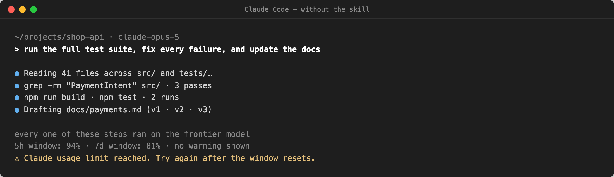 | 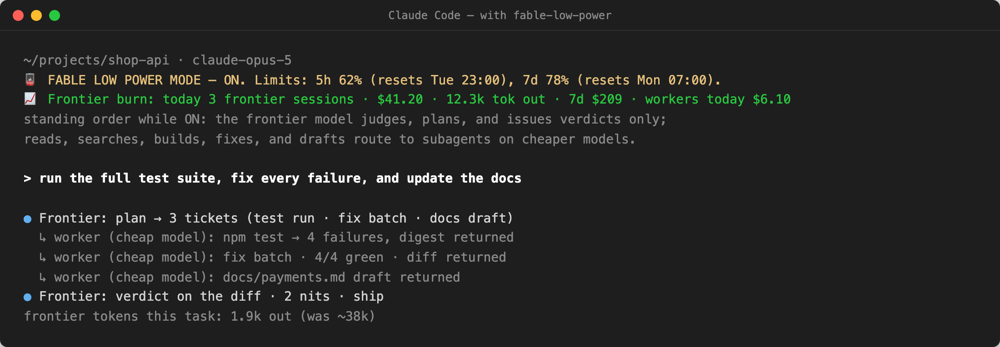 |

[Read more →](skills/fable-low-power/)

### keep-awake

An overnight agent run dies when the laptop sleeps, and you find out at 9 am
that half the suite never ran. This arms `caffeinate` behind a detached
self-healing guard that session interrupts cannot kill, and proves the sleep
assertion is held with `pmset` instead of assuming it.

| before | after |
|---|---|
| 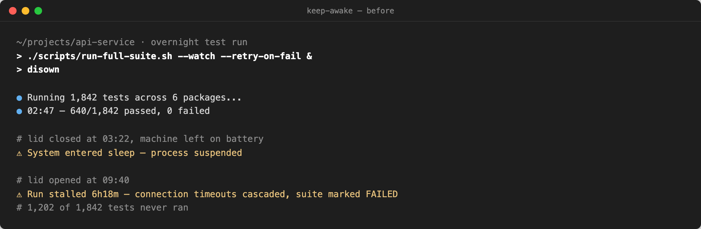 | 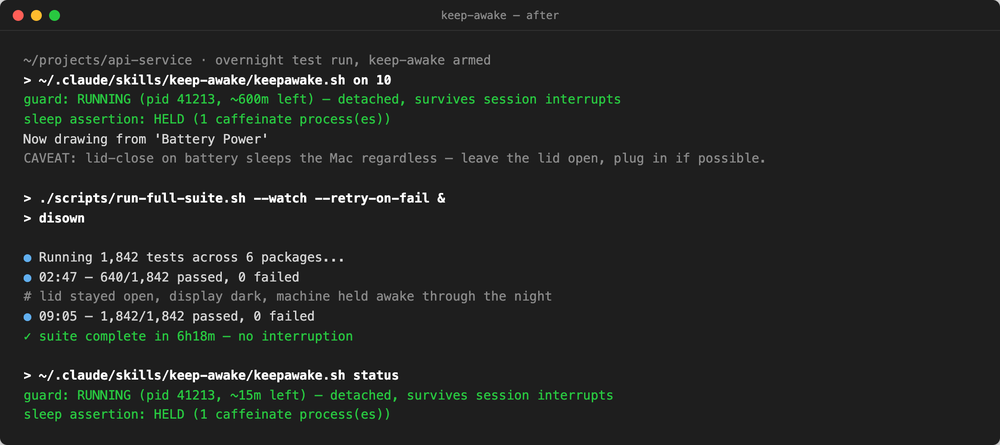 |

[Read more →](skills/keep-awake/)

### pr-review-response

Review comments get answered as scattered "done 👍" replies with no evidence,
and one item is always missed. This drafts ONE comment that mirrors the
reviewer's structure: every item gets a disposition (FIXED / DEFERRED /
DISCLOSED / REFUTED), a file:line, and the evidence.

| before | after |
|---|---|
|  |  |

[Read more →](skills/pr-review-response/)

### size

"How big is this?" gets "about a day", and three days later scope has crept
into something nobody planned. This checks for reuse, names the unknowns,
scores five factors into a T-shirt size, splits anything L or bigger into
M-or-smaller milestones, and runs a predicted-vs-actual retro when the work
lands.

| before | after |
|---|---|
| 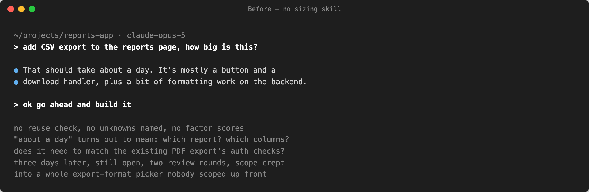 | 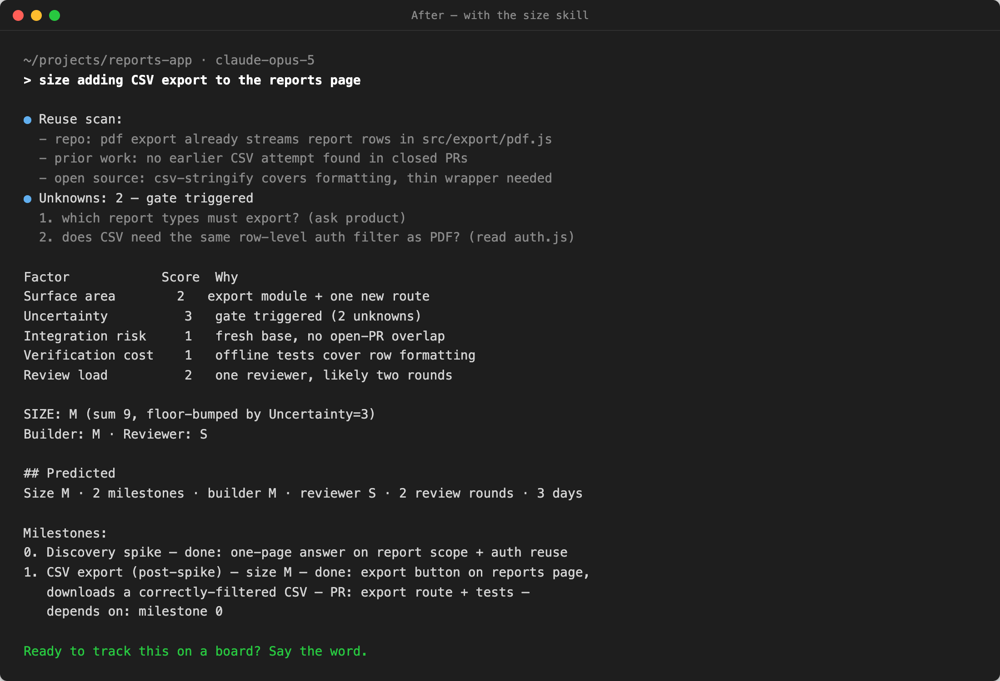 |

[Read more →](skills/size/)

## Install

Paste into Claude Code or any coding agent:

```text
Install the <skill-name> skill globally from https://github.com/ussumant/useful-agent-skills and read its README
```

With `npx`:

```sh
npx skills add ussumant/useful-agent-skills --skill <skill-name> --global --yes
```

By hand:

```sh
git clone https://github.com/ussumant/useful-agent-skills.git
cp -r useful-agent-skills/skills/<skill-name> ~/.claude/skills/<skill-name>
```

A few skills need a line of `settings.json` wiring (a hook or a statusline);
the skill's own README has the exact snippet.

## What's inside a skill

One self-contained folder: `SKILL.md` (what the agent loads), the scripts it
needs, and `examples/before.png` + `after.png` on a general task. Plain bash,
python3 stdlib, or node with the dependency named. Nothing phones home.

Adding one? The bar is in [CONTRIBUTING.md](CONTRIBUTING.md).

## License

MIT
