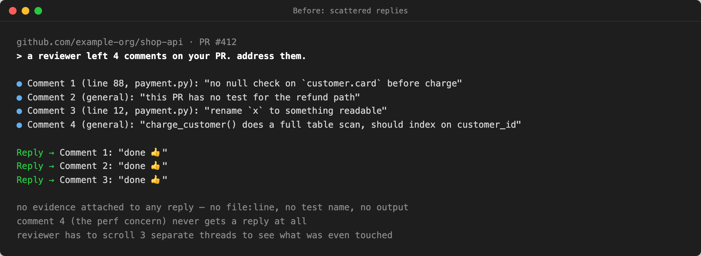
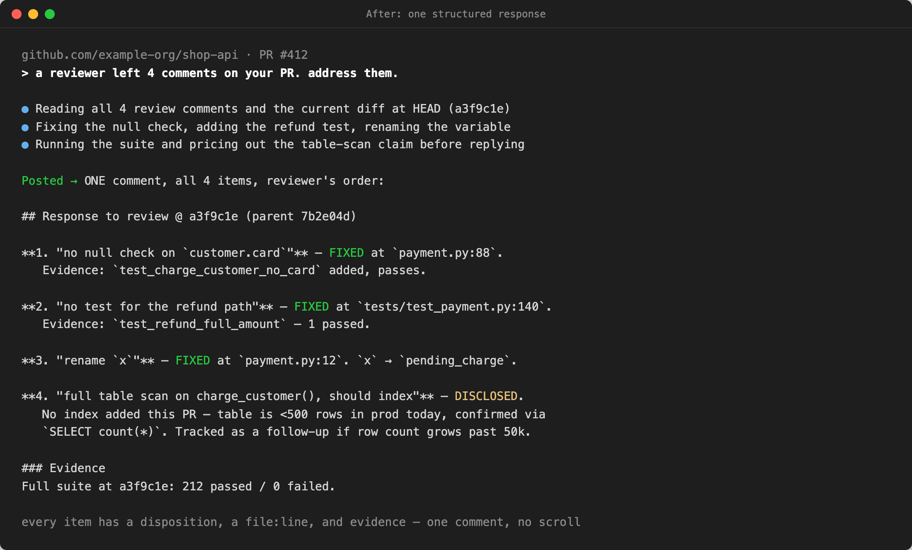

# pr-review-response

Answer every point in a code review, in one comment, with proof.

## Problem

A reviewer leaves several findings on a pull request. The default response is
a handful of scattered replies — "done 👍" on the easy ones, no evidence
attached, and the harder finding (the one that actually needed a judgment
call) quietly never gets an answer. The reviewer has to reopen several
threads to figure out what was actually touched, and the item that got
skipped reads as ignored rather than considered.

## What it does

Turns "respond to the review" into one disciplined pass:

- Reads every comment the reviewer left, in their own order.
- For each one, assigns a disposition: **FIXED** (with file:line and
  evidence), **DEFERRED** (with where it's tracked and why), **DISCLOSED**
  (an honest residual, stated plainly instead of folded into a done-claim),
  or **REFUTED** (with the reproduction that shows the finding doesn't hold).
- Posts it as ONE comment that mirrors the reviewer's own structure —
  never a paraphrased summary the reviewer has to re-map onto their own list.

## Before / after

Same PR, same four review comments (a null-check, a missing test, a naming
nit, a perf concern). Both images are renderings of the skill's real output
format with example file names and numbers standing in for a real diff.
Transcripts in [`examples/`](examples/).

Before: three scattered "done" replies with no evidence, and the fourth
comment — the one that needed a judgment call — never gets answered.



After: one comment, all four items in the reviewer's order, each with a
disposition, a file:line, and the evidence that backs it.



## How to install

Paste this into Claude Code (or any coding agent):

```text
Install the pr-review-response skill globally from https://github.com/ussumant/useful-agent-skills and wire it up per its README
```

Or with `npx`:

```sh
npx skills add ussumant/useful-agent-skills --skill pr-review-response --global --yes
```

No config, no hooks, no dependencies — it's an instructions-only skill. Once
installed, it triggers automatically on phrases like "respond to the
review", "reply to reviewer", or "address review comments".

## How to use

Ask your agent to respond to a review the normal way ("address the review
comments on this PR", "reply to the reviewer"). The skill loads the comment
template and structure rules, drafts the point-by-point response against the
actual diff and test output, and gives you the finished comment text to
review and post — it does not post to GitHub (or any other host) on its own.

## What's inside

- [`SKILL.md`](SKILL.md) — the structure rules, the anti-patterns that cost a
  review round, and the comment template.

## Honest caveats

- This skill drafts the response; a human posts it. It does not call any
  review-platform API, and it does not verify GitHub/GitLab credentials.
- Every "FIXED" and "REFUTED" claim in the draft is only as good as the
  evidence behind it — the skill's job is to force each item to name its
  test, command, or output, not to invent one. Check that the referenced
  test names and file:line locations are real before posting.
- It assumes fixes already landed. If the fixes aren't done yet, do that
  first — this skill is for the reply, not the implementation.

## License

MIT
